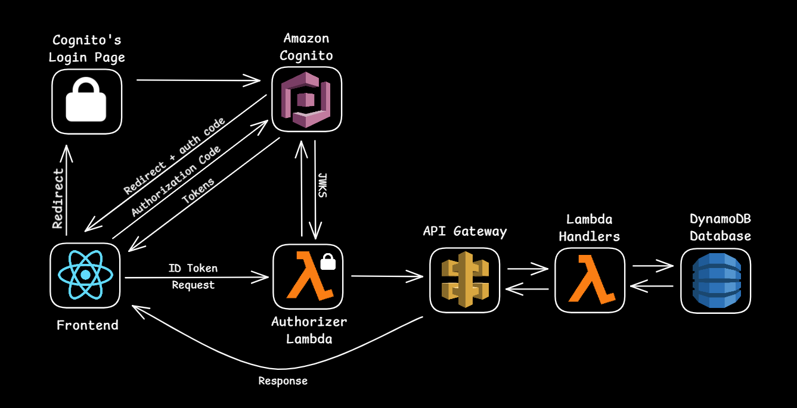

# Code Challenge: tokenlab-calendar

## Description

This is a full-stack calendar application built for a code challenge interview. It consists of a serverless backend deployed using AWS CDK and a Vite React TypeScript frontend. The app allows users to authenticate via Cognito and manage calendar events using React Big Calendar and custom frontend components.

## Live Demo

https://tl-calendar.netlify.app/

## Tech Stack

#### Backend:

- AWS CDK
- API Gateway (TypeScript)
- Lambda (Node.js / TypeScript)
- DynamoDB
- Cognito

#### Frontend:

- Vite
- React TypeScript
- React Query
- Styled Components
- React Big Calendar

## Architecture Overview

The backend is a serverless API exposed through API Gateway, handling requests via Lambda functions and storing data in DynamoDB. The frontend interacts with the API using authenticated requests and renders events using React Big Calendar. Authentication is handled by Cognito and OIDC.

#### Diagram:



## Setup Instructions

#### Prerequisites

- Node.js
- AWS CLI
- AWS CDK

#### Installation

1. Clone the project:

```
git clone https://github.com/luislanga/desafio-tokenlab.git
cd desafio-tokenlab
```

2. Install Dependencies

```
cd backend && npm install
cd ../frontend && npm install
```

#### CDK Stack Deployment

Cognito domain prefix: Cognito is set up to generate a domain. Provide any valid string at:

```
./backend/lib/constructs/CognitoUserPoolConstruct.ts
```

Replace:

```
domainPrefix: "<Your domain prefix here>"
```

Deploying the CDK Stack:

```
cd backend
cdk deploy
```

#### Running the Frontend Locally

Create a `.env` file at `./frontend`. Follow the schema on `.env.example`.

Where to find the values for `.env`:

```
VITE_BASE_URL=
<On CDK deployment the utility will return your endpoints. Alternatively, you can get this from the AWS Console under API Gateway Stages>

VITE_COGNITO_CLIENT_ID=
VITE_COGNITO_DOMAIN=
VITE_COGNITO_AUTHORITY=
VITE_COGNITO_LOGOUT_URI=
VITE_COGNITO_REDIRECT_URI=
VITE_COGNITO_RESPONSE_TYPE=
VITE_COGNITO_SCOPE=
<You can get all of the above under your Cognito App Client in AWS Console. Pick 'React App Client'.>
```

Run the project:

```
cd frontend
npm run dev
```

For backend and frontend specific documentation, navigate to `./backend` or `./frontend`.

## Final Considerations

The project was intentionally developed with a focused scope, given the timeframe. Further suggested increments

<details>
<summary>Click to expand</summary>

- **Pagination** - Add pagination for event fetching, using a more sensible time frame based on the current date. This would help avoid fetching large lists of outdated events or those far into the future, improving both performance and user experience.

- **RSVP and Events with Guests** - Though the routes and database schema were developed with RSVP functionality and the ability to manage events with guests in mind, due to time constraints, this feature was not fully implemented. Future work should include adding functionality for users to RSVP to events and manage guest lists effectively.

- **UI/UX Improvements** - Enhance the overall user interface and experience, focusing on responsiveness, consistency, and visual appeal.

- **Tests and CI/CD Pipeline** - Add automated tests to ensure the reliability and stability of the application as it scales. Setting up a Continuous Integration/Continuous Deployment (CI/CD) pipeline would allow for seamless integration and deployment with automated tests run on each change.

- **Refactoring** - Refactor sections of the code to improve readability, maintainability, and performance. This can include simplifying complex functions, modularizing the code, and cleaning up unused code or variables.

- **Frontend Validation for Business Logic** - There are several conditions required for the app to function correctly (e.g., event start date must be before the end date, valid user input formats, etc.). These conditions have been implemented in the backend, but due to time constraints, the frontend validations have not been fully addressed. Future work should include adding these validations on the frontend to ensure that users are guided to input valid data before submission, avoiding unnecessary fetching.

- **Smoother Auth Flow** - Rather than redirecting the user to an external authentication page, the app could handle the authentication process internally.
</details>
